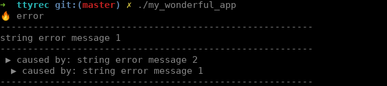
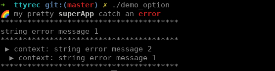

# my-pretty-failure #

[](https://travis-ci.org/AlbanMinassian/my-pretty-failure)
[](https://codecov.io/gh/AlbanMinassian/my-pretty-failure)
[](https://opensource.org/licenses/MIT)
[](https://crates.io/crates/my-pretty-failure)

my-pretty-failure display [failure](https://github.com/rust-lang-nursery/failure) (and context) in an elegant way

## Usage ##

``Cargo.toml``

```rust
[dependencies]
my-pretty-failure = "0.1.3"
```

## Usage n°1

With defaut option

```rust
#[macro_use] extern crate failure;
extern crate my_pretty_failure;
use my_pretty_failure::myprettyfailure;
use failure::Fail;

fn main() {
    let err3 = format_err!("string error message 1");
    let err2 = err3.context(format_err!("string error message 2"));
    let err1 = err2.context(format_err!("string error message 1"));
    println!("{}", myprettyfailure(&err1));
}

```
console output




## Usage n°2

With your option

```rust
#[macro_use] extern crate failure; use failure::Fail;
extern crate my_pretty_failure; use my_pretty_failure::{myprettyfailure_option, MyPrettyFailurePrint};
extern crate yansi; // or ansi_term, colored, term_painter ...

fn main() {
    let err3 = format_err!("string error message 1");
    let err2 = err3.context(format_err!("string error message 2"));
    let err1 = err2.context(format_err!("string error message 1"));
    println!("{}", myprettyfailure_option(MyPrettyFailurePrint {
        head: format!("🌈 my pretty {} catch an {}", yansi::Paint::white("superApp").bold(), yansi::Paint::red("error").bold()),
        separator: "****************************************".to_string(),
        causedby: "context".to_string(),
    }, &err1));
}

```
console output




## Other example ##

``cargo run --example helpme``

## Links ##

- [documentation my-pretty-failure (docs.rs)](https://docs.rs/my-pretty-failure)

## License ##

Copyright © 2018, [Alban Minassian](https://github.com/AlbanMinassian)

Permission is hereby granted, free of charge, to any person obtaining a copy of this software and associated documentation files (the “Software”), to deal in the Software without restriction, including without limitation the rights to use, copy, modify, merge, publish, distribute, sublicense, and/or sell copies of the Software, and to permit persons to whom the Software is furnished to do so, subject to the following conditions:

The above copyright notice and this permission notice shall be included in all copies or substantial portions of the Software.

The Software is provided “as is”, without warranty of any kind, express or implied, including but not limited to the warranties of merchantability, fitness for a particular purpose and noninfringement. In no event shall the authors or copyright holders X be liable for any claim, damages or other liability, whether in an action of contract, tort or otherwise, arising from, out of or in connection with the software or the use or other dealings in the Software.
Except as contained in this notice, the name of the [Alban Minassian](https://github.com/AlbanMinassian) shall not be used in advertising or otherwise to promote the sale, use or other dealings in this Software without prior written authorization from the [Alban Minassian](https://github.com/AlbanMinassian).
